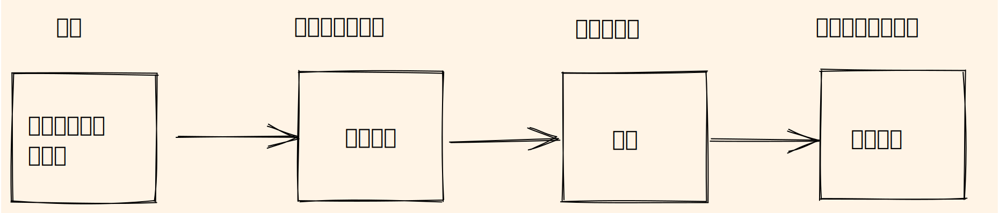
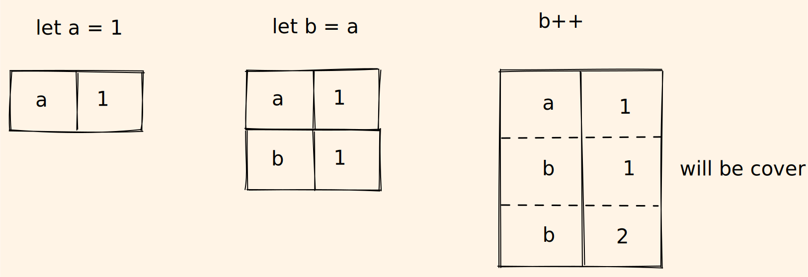
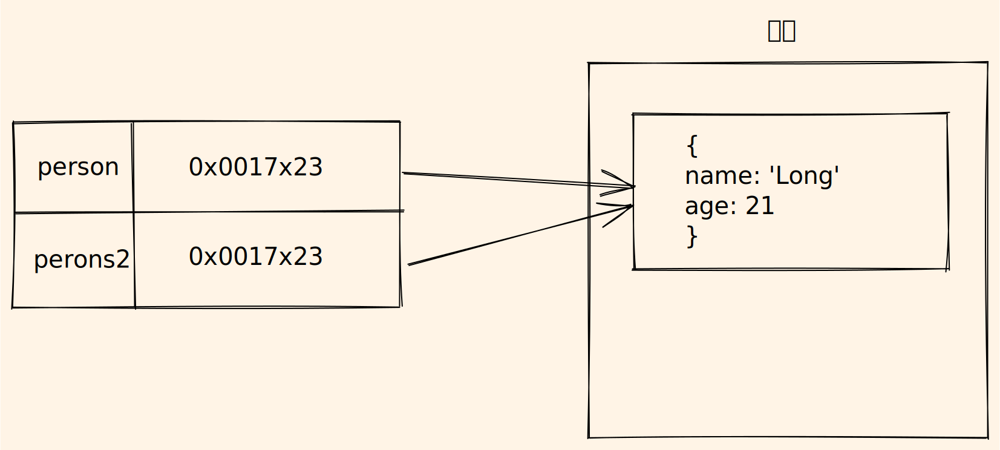

# Javascript Knowledge System

## 内存与数据结构

把一个页面当成一个完整的应用，那么就会有个体的参与



### 个体

> 讨论个体，主要思考应用运行中，哪些个体会参与进来的问题

个体会在应用运行中参与进来，在`JS`中可以通过声明变量，函数和对象来明确个体

```js
const a = 1 // 变量
const b = () => {} // 函数
const c = {} // 对象
```

### 数据类型

> 讨论数据类型，主要思考个体是以什么形式存在

#### 基础类型

`ES6`定义了8种数据类型

| 基础类型  | 值                                      |
| --------- | --------------------------------------- |
| Number    | 所有数字                                |
| String    | 所有字符串                              |
| Null      | null                                    |
| Undefined | undefined                               |
| Boolean   | true and false                          |
| Sympol    | 符号类型 `const sym = Sympol('sympol')` |
| Bigint    | 整数末尾添加n                           |

**基础类型是按值访问的，并且值是不能够被修改**

```js
let a = 1
let b = a
b++

console.log(a) // 1
console.log(b) // 2
```



```js
const s = 'js knowledge system'
s[0] = 'J'
console.log(s.charAt(0)) // j
```

当两个基础类型进行比较时，本质上是值的比较

```js
const a = 1
const b = 2

a === b // 1 === 2
```

基础类型是可以访问方法，原因是`JS`为每一种基础类型都提供了**包装对象**

```js
const _s = new String('js') // 使用包装对象构建对象

_s.chatAt(0) // 包装对象实例访问方法

_s = null // 使用完销毁包装对象
```

#### 引用类型

**引用类型是按引用(内存地址)访问，并且值是可以改变的**

```js
const person = {
  name: 'Long',
  age: 18
}

const person2 = person

person2.age = 21

console.log(person.age) // 21
console.log(person2.age) // 21
```

变量`person`和值对象并不是直接连接的，而是通过值对象的内存地址进行对象访问，并且将内存地址复制给`person2`（浅拷贝）



引用类型在比较时也是比较内存地址

```js
// 虽然`a`和`b`的值是一样的，但是内存地址不一样，所以不相等
const a = {}
const b = {}

a == b // false
```

### 内存

> 讨论内存，主要思考应用运行时，个体存放在哪里

计算机提供两种存储信息的方式

- 内存：存储应用运行时的信息，`CPU`通过寄存器寻址直接访问内存数据，访问速度快
- 硬盘：存储持久化数据，`CPU`通过硬件控制器访问，访问速度慢

`JS`应用运行时的数据存储于内存中，也能通过浏览器提供的`localStorage`进行持久化存储

`JS`运行时数据在内存分为**栈内存**和**堆内存**，两种内存都是内存，区别在于存取方式

 应用运行中，会为每一个个体分配内存空间，当个体参与完之后需要将该个体的内存空间释放

- 栈内存：自动释放出栈个体的内存空间
- 堆内存：采用垃圾自动回收机制管理内存

```js
const a = 1 // 给个体分配内存空间

alert(a + 1) // 参与应用程序，使用内存

a = null // 参与完毕，释放内存
```

垃圾回收依赖`引用`，在内存空间中，尝试访问数据，能够被访问的视为该数据能被获取，不能访问的数据会被打上标记，垃圾回收机制会定期在全局对象开始查找被标记的数据并释放其内存

> 在全局中，垃圾回收机制无法判断全局声明的内存合适释放

内存由一个个小的存储单元组成，每个单元具备存储数据和读取数据能力，以8位二进制为一个单元，1位16进制作为内存地址


> 变量名对应着内存地址，变量的值对应存储单元的数据

### 数据结构

> 讨论数据结构，主要思考个体在内存是如何存放的

#### 栈

先进后出，后进先出

问：封装一个十进制转二进制的方法

```js
const converter = (n, bs) => {
  const r = []
  let s = ''

  while (n > 0) {
    r.push(n % bs)

    n = Math.floor(n / bs)
  }

  while (r.length) {
    s += r.pop()
  }

  return s
}

```

问：给定一个只包括 小括号 '(' ')' ，中括号 '[' ']' 大括号 '{' '}' 的字符串，判断字符串是否有效

```js
const isValid = s => {
  const r = []

  for (let i = 0; i < s.length; i++) {
    const currentString = r[r.length - 1]

    if (currentString === '(' && s[i] === ')' ||
      currentString === '{' && s[i] === '}' ||
      currentString === '[' && s[i] === ']'
    ) {
      r.pop()
    } else {
      r.push(s[i])
    }
  }

  return r.length === 0
}
```

#### 队列

先进先出

#### 链表

#### 堆

## V8引擎

`V8`引擎是`JS`引擎的一种，它也是应用程序，它是`JS`执行环境，也是浏览器组成部分，负责**解析**和**编译**`JS`


虚线右边`Blink`是渲染引擎，虚线左边是`JS`引擎的`pipeline`

### Scanner

`Scanner`模块会扫描`JS`文件里的字符，并转换成`token`

> `token`是语法中不能分割的最小单元

```js
const a = 1
```

会被转换成

```js
[
  {
    "type": "Keyword",
    "value": "const"
  },
  {
    "type": "Identifier",
    "value": "a"
  },
  {
    "type": "Punctuator",
    "value": "="
  },
  {
    "type": "Numeric",
    "value": "1"
  }
]
```

### Parser

`Parser`模块会把`tokens`解析成`AST` (Abstract Syntax Tree)，主要作用是

- 分析语法错误
- 确定词法作用域（生成`[[scope]]`）
- 生成`AST`

> [在线解析 esprima](https://esprima.org/demo/parse.html#)

```js
const a = 1
```

会被解析成

```js
{
  "type": "Program",
  "body": [
    {
      "type": "VariableDeclaration",
      "declarations": [
        {
          "type": "VariableDeclarator",
          "id": {
            "type": "Identifier",
            "name": "a"
          },
          "init": {
            "type": "Literal",
            "value": 1,
            "raw": "1"
          }
        }
      ],
      "kind": "const"
    }
  ],
  "sourceType": "script"
}
```

同时，由于优化问题，会把解析分为`pre-parsing`和`full-parsing`

`pre-parsing`会去解析**不会立即执行**的代码

- 不会生成`AST`
- 生成不带有变量和声明的`[[scope]]`
- 解析速度快

`full-parsing`会去解析立即执行的代码

- 生成`AST`
- 生成完整的`[[scope]]`
- 解析速度不快

```js
function a() {} // 声明函数但是没有执行，预解析

function b() {} // 声明函数但是没有执行，预解析

(function c() {})() // 声明函数并立即执行，全量解析

b() // 再次解析该函数，并且是全量的
```

上述函数`b`会被解析两次，但如果函数`b`嵌套了函数，那么嵌套的函数也是被解析两次

**减少不必要的嵌套函数，能提高代码执行效率**

> `v8`引擎会缓存3天解析的结果，所以分隔业务代码和第三方库代码，有助于提高代码执行效率

### Ignition

这个是解释器，会把`AST`转化为字节码，并且收集编译的信息

> 也可以理解为预编译，基于性能考虑，有时候预编译和编译的界限没有那么清晰，有的代码在预编译下就能执行

### Turibofan

这是是编译器，也是代码执行阶段，利用`Igniton`收集到的信息，将字节码编译成汇编，在满足条件下，会直接优化成机器码，提高效率

有一个建议能提高代码执行效率，就是不要总是**改变对象类型**

```js
const a = (o) => o.name
```

当传入不同类型的对象（对编译器而言）

```js
o1 = { name: 'a' }
o1 = { name: 'b', age: 18 }
o1 = { name: 'c', age: 18, gender: 1 }
```

编译器无法针对上述情况做优化，会降低执行效率，**所以这也是`typescript`作用之一**

### Orinoco

这是垃圾回收对象，用来管理内存

- 标记阶段，标记活动对象和非活动对象
- 清除阶段，清除非活动对象
- 整理阶段，合并和整理内存

> 不会清理全局对象内存

## 函数

### 作用域

规定变量和函数可访问范围的机制，在词法分析（预解析）确定下来

####全局作用域

- `window`对象的属性和方法
- 最外层的声明
- 非严格模式下，函数中未定义并且赋值的变量和函数

####函数作用域

- 函数的花括号

####`ES6`后的块级作用域

对`var`的声明无效，只能束缚`let`和`const`

> 最外层`var`声明的变量和函数会挂载到`window`对象上，最外层`let`和`const`声明的变量和函数会挂载到`script`对象

#### 变量提升

`var`定义的变量会`变量提升`并且赋值为`undefined`，并且可以对其进行访问和赋值

```js
console.log(a) // undefined
a = 2
console.log(a) // 2
var a = 1
console.log(a) // 1
```

`let`和`const`定义的变量也会`变量提升`，但不会被赋值，并且不能对其进行访问和赋值，这也称为`暂时性死区`

```js
console.log(b); // ReferenceError: b is not defined
b = 2; // Cannot access 'b' before initialization
let b = 1;
console.log(b); // 1
```

> `const`对于基础数据类型，其赋值不能被修改，对于引用数据类型，其赋值的引用（内存地址）不能被修改

### 作用域链

大概是说一个函数能访问的范围，具体实现表现在`[[scope]]`这个数组上

```js
const a = 20

const test = () => {
  const b = a + 10

  const innerTest = () => {
    const c = 10


    return b + c
  }

  console.dir(innerTest)
  console.dir(test)
  return innerTest()
}

test()
```


```js
const a = 20

const test = () => {
  const b = a + 10

  const innerTest = () => {
    const innerInnerTest = () => {
      return b
    }
    console.dir(innerInnerTest)
  }
  console.dir(innerTest)
  return innerTest()
}

test()
```


在函数作用域中，寻找的变量首先会在该函数当前执行上下文中寻找，然后再通过作用域链`[[scope]]`去寻找

`[[scope]]`组成对象

- `global`对象
- `script`对象
- `closure`对象
- `local`对象

其中`local`对象并不会在预解析阶段就被确定，而是在函数执行中才会生成，随着函数执行而变化，记录函数执行上下文的变量和函数，也确定`this`指向

### 函数调用栈

`JS`使用函数调用栈来管理所有函数的执行

```js
const a = () => {} // 函数表达式
function b() {} // 函数声明
```

无论采用哪种方式声明，在预解析时都会创建函数体，并**一直存在于内存中**，所以运行程序可以在任何时候调用函数

> 函数体也是个对象，对象存储在堆内存中

#### 执行上下文

声明函数需要创建函数体，函数体占据一定内存，而执行函数会创建`执行上下文`，`执行上下文`也会占据新内存，`执行上下文`会根据函数体的代码逻辑，实时记录函数的状态和数据

`执行上下文`占据的内存空间是临时的，函数执行完毕其内存空间会被释放

> 每一次调用函数，都会创建`执行上下文`

`JS`代码的执行都必须进入**执行上下文**中，`JS`运行中会有3种环境

- 全局环境
- 函数环境
- ~~`eval`环境~~

`JS`引擎通过栈来管理函数执行，这就是`函数调用栈`，栈底永远都是全局环境，栈顶就是`运行上下文`

```js
var color = 'blue';

function changeColor() {
  var anotherColor = 'red';

  function swapColors() {
    var tempColor = anotherColor;
    anotherColor = color;
    color = tempColor;
  }

  swapColors();
}

changeColor();
```


```js
function f1() {
  var n = 999;
  function f2() {
    alert(n);
  }
  return f2;
}
var result = f1();
result(); // 999
```


> 可以使用`console.trace()`打印函数调用栈

#### 汇编入门

冯诺伊曼体系结构：**将不可改变的硬件变为可编程的软件**

- 计算机处理的数据和指令，一律都是二进制
- 数据和指令不区分，混合存储在同一个存储器中
- 顺序执行程序的每一条指令
- 计算机硬件由运算器，控制器，存储器，输入设备和输出设备组成


指令：控制计算机行为的指示和命令，通常包含操作码和操作数

`CPU`：由处理单元和控制单元组成

- 处理单元 Processing Unit 包含算术逻辑和处理寄存器，负责算术和逻辑运算
- 控制单元 Control Unit 包含程序计数器和指令寄存器，负责控制程序流程

寄存器：`CPU`内部元件，存放`CPU`数据和指令的一小块存储区域或暂存运算数据和运算结果


- 地址线：CPU 通过地址线进行寻址，指定存储单元地址
- 数据线：CPU 和其他部分能通过数据总线相互传递数据
- 控制线：控制线决定了 CPU 对外部器件的控制能力

以32位`CPU`来说，包括以下寄存器：

| **寄存器**  | **概述**                                                     |
| :---------- | :----------------------------------------------------------- |
| eax         | 累加器，可用于加减乘除等操作，使用频率高                     |
| ebx         | 基地址寄存器，可以作为存储器指针来使用                       |
| ecx         | 计数寄存器，在循环和字符串操作时，用它来控制循环次数         |
| edx         | 数据寄存器，在进行乘除运算时，可作为默认操作数参与运算，可存放I/O的端口地址 |
| esi/edi     | 变址寄存器，用于存放存储单元的地址偏移量，可实现多种寻址方式 |
| ebp         | 基指针寄存器，用于存取栈中的数据                             |
| esp         | 栈指针寄存器，用于实时记录栈内存的栈顶位置                   |
| ees/efs/egs | 附加段寄存器，其值为附加数据段的段值                         |
| ecs         | 代码段寄存器，其值为代码段的段值                             |
| ess         | 栈段寄存器，其值为栈段的段值                                 |
| eds         | 数据段寄存器，其值为数据段的段值                             |
| eip         | 指令指针寄存器，用于存放下次将要执行的指令在代码段中的偏移量 |
| EFlags      | 标志寄存器，有多种标志，例如进位标志，溢出标志等             |

#### 栈的空间情况


### 闭包

闭包是一个特殊的对象，当一个函数A嵌套了函数B，并函数B访问函数A的变量，那么在预解析时闭包就产生了，并存在于函数B的`[[scope]]`

```js
const a = () => {
  let num = 1
  
  const b = () => {
    console.log(++num)
  }
  console.dir(b)              
  return b
}
  
a()() // 2
a()() // 2
a()() // 2
```


创建了3次闭包

**如果我们保留了函数B的引用**

```js
const a = () => {
  let num = 1
  
  const b = () => {
    console.log(++num)
  }
  console.dir(b)              
  return b
}
  
const c = a()

c() // 2
c() // 3
c() // 4
```

这里只会创建一个闭包

**再多运行一次函数A**

```js
const a = () => {
  let num = 1
  
  const b = () => {
    console.log(++num)
  }
  console.dir(b)              
  return b
}
  
const c = a()

c() // 2
c() // 3
c() // 4

const d = a()

d() // 2
d() // 3
d() // 4
```

每次运行函数B都会创建上下文，两个不同的引用对应两个不同的闭包

#### `for`循环

需要让下面这个`for`循环输出1, 2, 3, 4, 5

```js
for (var i = 1; i <= 5; i++) {
  setTimeout(function timer() {
    console.log(i);
  }, i * 1000);
}
```

方案一

```js
for (let i = 1; i <= 5; i++) {
  setTimeout(function timer() {
    console.log(i);
  }, i * 1000);
}
```

方案二

```js
for (var i = 1; i <= 5; i++) {
  (function (i) {
    setTimeout(function timer() {
    	console.log(i)
  	}, i * 1000)
  })(i)
}
```

#### 单例

```js
const createInstance = (() => {
  let instance = null;
  
  return obj => {
    return instance ? instance : instance = obj
  }
})()
```

#### 模块化

```js
var module_status = (function () {
  var status = {
    number: 0,
    color: null
  }

  var get = function (prop) {
    return status[prop];
  }

  var set = function (prop, value) {
    status[prop] = value;
  }

  return {
    get: get,
    set: set
  }
})();

var module_color = (function () {
  // 假装用这种方式执行第二步引入模块 类似于 import state from 'module_status';
  var state = module_status;
  var colors = ['orange', '#ccc', 'pink'];

  function render() {
    var color = colors[state.get('number') % 3];
    document.body.style.backgroundColor = color;
  }

  return {
    render: render
  }

})();

var module_context = (function () {
  var state = module_status;

  function render() {
    document.body.innerHTML = 'this Number is ' + state.get('number');
  }

  return {
    render: render
  }
})();

var module_main = (function () {
  var state = module_status;
  var color = module_color;
  var context = module_context;

  setInterval(function () {
    var newNumber = state.get('number') + 1;
    state.set('number', newNumber);

    color.render();
    context.render();
  }, 1000);
})();
```

### this

函数声明的`this`指向调用者`caller`

箭头函数的`this`指向声明函数时的上下文中

>  在函数创建其执行上下文中决定`this`的指向
>
>  严格模式下，全局下的函数声明的`this`不是`window`而是`undefined`

```js
// demo01
var a = 20;

var obj = {
  a: 40
}
function fn() {
  console.log('fn this: ', this);

  function foo() {
    console.log(this.a);
  }
  foo();
}

fn.call(obj); // 20
fn(); // 20
```

```js
// demo02
'use strict';

var a = 20;
function foo() {
  var a = 1;
  var obj = {
    a: 10,
    c: this.a + 20
  }
  return obj.c;

}

console.log(window.foo()); // 40
console.log(foo()); // Uncaught TypeError: Cannot read properties of undefined (reading 'a')
```

```js
// demo03
var a = 20;
var foo = {
  a: 10,
  getA: function () {
    return this.a;
  }
}
console.log(foo.getA()); // 10

var test = foo.getA;
console.log(test()); // 20
```

```js
function foo() {
  console.log(this.a)
}

function active(fn) {
  fn();
}

var a = 20;
var obj = {
  a: 10,
  getA: foo,
  active: active
}

active(obj.getA); // 20
obj.active(obj.getA); // 20
```

```js
var n = 'window';
var object = {
  n: 'object',
  getN: function () {
    return function () {
      return this.n;
    }
  }
}

console.log(object.getN()()); // window
```

#### apply

#### call

####bind

## 函数式编程

函数式编程是一种编程范式，核心思想就是封装，调用方不需要关心函数内部细节，只需要关注传入的参数和输出的结果

### 纯函数

纯函数核心就是相同的输入得到相同的输出

- 天然并发
- 利于缓存
- 利于移植

> 不依赖函数外的任何依赖，不产生副作用

### 高阶函数

高阶函数核心就是让当前函数拥有额外的能力

> 高阶组件也是这个思想

#### 手动实现一个`new`关键字

```js
const New = (func, ...arguments) => {
  const res = {}

  res.__proto__ = func.prototype

  const ret = func.apply(res, arguments)

  if ((typeof ret === 'object' || typeof ret === 'function') && ret !== null) {
    return ret
  }

  return res
}
```

```js
function Person(name, age) {
  this.name = name;
  this.age = age;
}
Person.prototype.getName = function() {
  return this.name;
}

// 使用上例中封装的New方法来创建实例
var p1 = New(Person, 'Jake', 18);
var p2 = New(Person, 'Tom', 20);
p1.getName(); // Jake
p2.getName(); // Tom
```

#### 手动封装`map`

```js
Array.prototype._map = function(fn, context) {
  const res = []
  
  for(let i = 0; i < this.length; i++) {
    res.push(fn.call(context, this[i], i, this))
  }
  
  return res
}
```

```js
[1, 2, 3, 4]._map(item => item + 1) // [2, 3, 4, 5]
```

#### 封装登陆逻辑

```js
// 高阶函数withLogin，用来判断当前的用户状态
(function() {
  // 用随机数的方式来模拟一个获取用户信息的方法
  const getLogin = function() {
    var a = parseInt(Math.random() * 10).toFixed(0));
    if (a % 2 == 0) {
      return { login: false }
    }

    return {
      login: true,
      userinfo: {
        nickname: 'jake',
        vip: 11,
        userid: '666666'
      }
    }
  }

  const withLogin = function(basicFn) {
    const loginInfo = getLogin();

    // 将loginInfo以参数的形式传入基础函数中
    return basicFn.bind(null, loginInfo);
  }

  window.withLogin = withLogin;
})();
```

```js
(function() {
  const withLogin = window.withLogin;

  const renderHomePage = function(loginInfo) {
    // 这里处理renderHomePage页面的逻辑

    if (loginInfo.login) {
      // 处理已经登录之后的逻辑
    } else {
      // 这里处理未登录的逻辑
    }
  }

  // 对外暴露接口时，使用高阶函数包一层，来执行当前页面的登录状态的判断
  window.renderHomePage = withLogin(renderHomePage);
})();
```

### 柯里化

柯里化指一个函数接收一个函数A，执行完生成新的函数继续执行函数A剩下的参数的函数

> 柯里化是高阶函数的一种运用

下面这种实现方式是错误的，柯里化后的函数都共享同一个闭包数据`func, arity和args`，其中`arity`会被第一个函数修改

```js
// arity 剩余参数的长度
// args 收集传入的参数
const curry = (func, arity = func.length, args = []) => {
  return () => {
    if (arguments.length < arity) {
      // 副作用
      arity -= arguments.length

      return curry(func, arity, args.push([].slice.call(arguments)))
    }

    return func.apply(func, args)
  }
}

function check(reg, targetString) {
  return reg.test(targetString);
}

check(/^1[34578]\d{9}$/, '14900000088');
check(/^(\w)+(\.\w+)*@(\w)+((\.\w+)+)$/, 'test@163.com');

const checkPhone = curry(check)(/^1[34578]\d{9}$/)
const checkEMail = curry(check)(/^(\w)+(\.\w+)*@(\w)+((\.\w+)+)$/)

checkPhone('183888888') // true
checkEmail('xxxxx@test.com') // 报错
```

> 定位问题花了好久，最后是打断点发现闭包里面的数据被修改才定位到的

真正的实现

```js
const createCurry = func => {
  return function curry(...args) {
    if (args.length >= func.length) {
      return func.apply(func, args)
    }
    
    return (...nextArgs) => curry.apply(func, args.concat(nextArgs))
  }
}
```

柯里化的扩展

```js
// 实现一个add方法，使计算结果能够满足如下预期：
add(1)(2)(3) // 6;
add(1, 2, 3)(4) // 10;
add(1)(2)(3)(4)(5) // 15;
```

```js
const add = (...args) => {
  const _args = []
  
  const _adder = (...nextArgs) => {
    _args.push(...nextArgs)
    return _adder
  }
  
  _adder.valueOf = () => _args.reduce((p, c) => p + c)
  
  return _adder(...args)
}
```

### 函数组合

函数组合指一个函数接收若干个函数，从左往右或从右往左依次执行，上一个函数执行结果作为下一个函数的参数

>  函数组合也是高阶函数的运用

之前封装的有一个登陆模块，现在有一个新需求就是判断用户当前的环境，根据不同环境做不同处理

```js
(function () {
  const getLogin = () => ({
    login: true,
    userInfo: {
      name: 'Long',
      age: 18
    }
  })

  window.withLogin = fn => fn.bind(null, getLogin())
})();

(function () {
  const env = {
    isPC: 'onclick' in document,
    isMobile: 'ontouchstart' in document,
    isAndroid: navigator.userAgent.match(/android/),
    isIOS: navigator.userAgent.match(/iphone/),
  }

  window.withEnv = fn => fn.bind(null, env)
})();

(function () {
  const withLogin = window.withLogin
  const withEnv = window.withEnv

  const withRenderHomePage = (envInfo, loginInfo) => {
    const div = document.createElement('div')
    const env = Object.keys(envInfo).filter(env => envInfo[env])[0]

    if (loginInfo.login) {
      div.innerText = `${loginInfo.userInfo.name} login in ${env.substring(2)}`
    } else {
      div.innerText = `no one login ${env.substring(2)}`
    }


    document.body.appendChild(div)
  }

  // withEnv和withLogin赋予了withRenderHomePage登陆信息和环境信息
  window.withRenderHomePage = withLogin(withEnv(withRenderHomePage))
})();
```

如果我们使用函数组合`compose`

```js
window.withRenderHomePage = compose(withLogin, withEnv, withRenderHomePage)
```

快速实现一版`compose`

```js
const compose = (...args) => args.reduceRight((pre, cur) => cur(pre))
```


