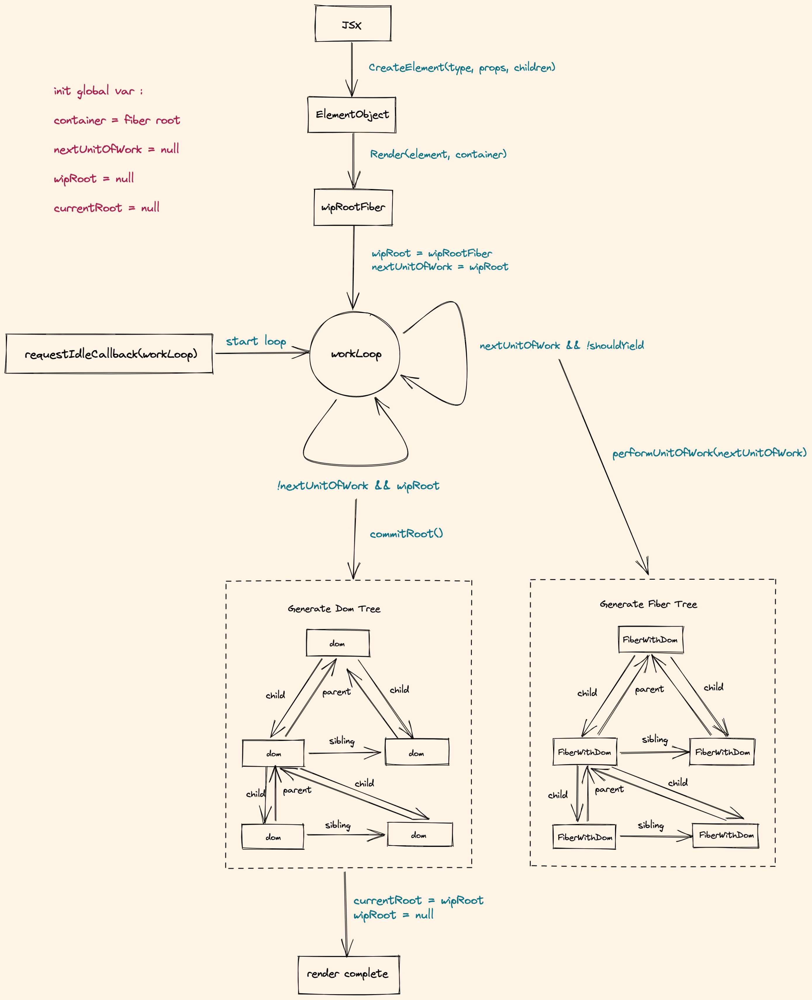
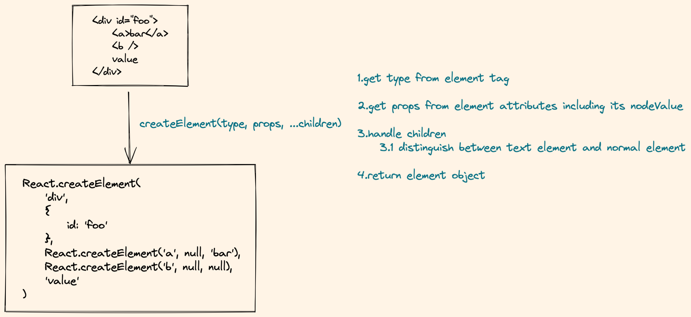
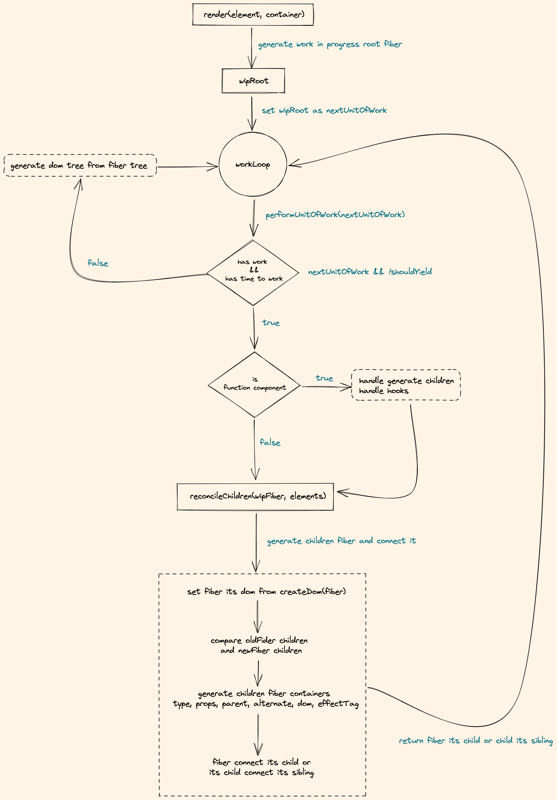
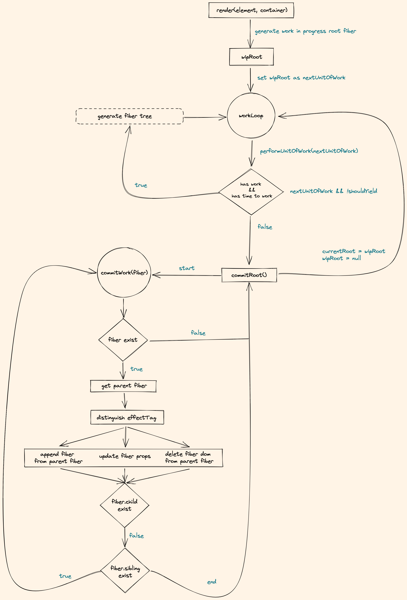

## Notes of React source code

Summarize the `react` flow according to post [build-your-own-react](https://pomb.us/build-your-own-react/) to help me dig deeper in `react`.

### JSX transfer to DOM flow

### createElement(type, props, ...children)

### render(fiber, elements)

### commit(fiber)

